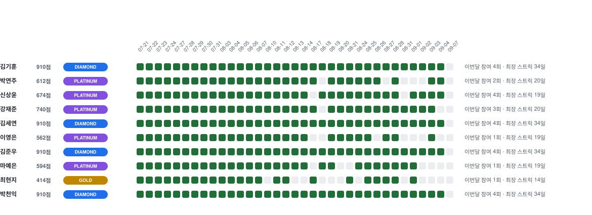

# 매일알고

---
<table>
  <tr>
    <td>진행 기간</td>
    <td>2026년 07월 20일 ~ </td>
  </tr>
  <tr>
    <td>플랫폼</td>
    <td>프로그래머스, 백준, SWEA, LeetCode</td>
  </tr>
  <tr>
    <td>언어</td>
    <td align="center">
       
       
    </td>
  </tr>
</table>


## 👩‍👦‍👦 **스터디 멤버**
<table>
  <tr>
    <td align="center"><a href="https://github.com/oneul0"></a></td>
    <td align="center"><a href="https://github.com/yeonju73"></a></td>
    <td align="center"><a href="https://github.com/Sangyoon-Shin"></a></td>
    <td align="center"><a href="https://github.com/BBZJUN"></a></td>
    <td align="center"><a href="https://github.com/yonseeee"></a></td>
  </tr>
  <tr>
    <td align="center"><a href="https://github.com/oneul0"><b>김기훈</b></a></td>
    <td align="center"><a href="https://github.com/yeonju73"><b>박연주</b></a></td>
    <td align="center"><a href="https://github.com/Sangyoon-Shin"><b>신상윤</b></a></td>
    <td align="center"><a href="https://github.com/BBZJUN"><b>강재준</b></a></td>
    <td align="center"><a href="https://github.com/yonseeee"><b>김세연</b></a></td>
  </tr>
  <tr>
    <td align="center">
    <td align="center">
    <td align="center">
    <td align="center">
    <td align="center">
  </tr>
    <tr>
    <td align="center"><a href="https://github.com/ye0ngeun"></a></td>
    <td align="center"><a href="https://github.com/Woody-Hill"></a></td>
    <td align="center"><a href="https://github.com/yeeunma"></a></td>
    <td align="center"><a href="https://github.com/hyunji-ch5i15"></a></td>
    <td align="center"><a href="https://github.com/qkrcjsdlr10"></a></td>
  </tr>
  <tr>
    <td align="center"><a href="https://github.com/ye0ngeun"><b>이영은</b></a></td>
    <td align="center"><a href="https://github.com/Woody-Hill"><b>김준우</b></a></td>
    <td align="center"><a href="https://github.com/yeeunma"><b>마예은</b></a></td>
    <td align="center"><a href="https://github.com/hyunji-ch5i15"><b>최현지</b></a></td>
    <td align="center"><a href="https://github.com/qkrcjsdlr10"><b>박천익</b></a></td>
  </tr>
  <tr>
    <td align="center">
    <td align="center">
    <td align="center">
    <td align="center">
    <td align="center">
  </tr>
</table>

<br />

<br />

<!-- ALGORITHM_GRASS:START -->
## 🌱 알고리즘 잔디

> 각 칸은 해당 날짜의 필수 문제 풀이 비율을 나타냅니다. 칸을 클릭하면 날짜별 문제 폴더로 이동합니다.

[](./problem_solve)
<!-- ALGORITHM_GRASS:END -->

<br />

<br />

<!-- ALGORITHM_ACTIVITY:START -->
## 🌱 알고리즘 잔디

> 평일 **1일 1문제** 기준입니다. 초록색이면 해당 날짜 문제 풀이 완료입니다.

[](./problem_solve)

## 🏅 참여 점수

| 이름 | 점수 | 최장 스트릭 | 배지 |
|:---|---:|---:|:---:|
| 김기훈 | **460점** | **19일** |  |
| 박연주 | **460점** | **19일** |  |
| 신상윤 | **460점** | **19일** |  |
| 강재준 | **490점** | **20일** |  |
| 김세연 | **460점** | **19일** |  |
| 이영은 | **430점** | **18일** |  |
| 김준우 | **460점** | **19일** |  |
| 마예은 | **460점** | **19일** |  |
| 최현지 | **332점** | **14일** |  |
| 박천익 | **460점** | **19일** |  |

> **점수 규칙:** 첫 풀이 10점, 연속 풀이가 이어질 때마다 다음 풀이에 +2점. 스트릭 보너스는 최대 +20점으로 하루 최대 30점입니다.

> 문제를 놓친 스터디 날짜가 있으면 스트릭은 초기화됩니다. 토·일과 문제 폴더가 없는 날은 스트릭을 끊지 않습니다.

> **배지:** BRONZE 1+ · SILVER 100+ · GOLD 250+ · PLATINUM 500+ · DIAMOND 800+
<!-- ALGORITHM_ACTIVITY:END -->

<br />

### 🟨 08-17 데일리 문제
[Permutations](https://leetcode.com/problems/permutations/description/)


<br />

### :pencil: Rule  
1. 데일리 필수 문제는 꼭 풀어야 합니다.
2. 빠르게 성장하실 분은 선택 문제도 풀어보아요.
3. 매주 정기 스터디 1번 필참해주세요.

<br />
<br />

## ✅ 참여 방법
1. 이 저장소를 `fork` 한다. 
2. `problem_solve`에 자동 생성된 데일리 문제 폴더에서 해당 문제 디렉터리를 확인한다.
3. 해당 문제 폴더에 자신의 소스코드를 업로드한다. 
4. 이때 `commit 규칙`을 지킨다.
5. 원본 저장소로 `Pull Request`를 보낸다. 
6. 다른 사람들의 PR을 보고 자유롭게 코드 리뷰를 한다.(PR후 리뷰를 위해 Merge 금지, 익일 9:00 일괄 Merge)

<br />
<br />

## ✅ 소스코드 파일 이름 규칙

```text
{GitHub 사용자명}.{확장자}
```

<br />

## ✅ 폴더 구조

```text
problem_solve/{날짜 또는 회차}/{[문제출처] 문제이름}/{GitHub 사용자명}.{확장자}
```

<br/>

## ⚠️ PR 규칙

```text
{문제 종류} - {문제 개수} 문제
```

- 💡 예시: `필수문제 - 5문제`

---

<br />
<br />

## 플랫폼

| 플랫폼    | 태그  |
|:-------|:----|
| 백준     | BOJ |
| 프로그래머스 | PGS |
| 삼성SW Expert Academy | SWEA |
| 리트코드   | LTC |

## 이모지 및 태그

- 이모지는 선택에 따라 활용한다.

| 이모지 | 태그       | 설명                      |
|:----|:---------|:------------------------|
| ✨   | feat     | 새로운 기능 추가               |
| 🐛  | fix      | 버그 수정                   |
| ♻️  | refactor | 코드 리팩토링                 |
| ✏️  | comment  | 주석 추가(코드 변경 X) 혹은 오타 수정 |
| 📝  | docs     | README와 같은 문서 수정        |
| 🔀  | merge    | merge                   |
| 🚚  | rename   | 파일, 폴더명 수정 혹은 이동        |

<br/>

---
